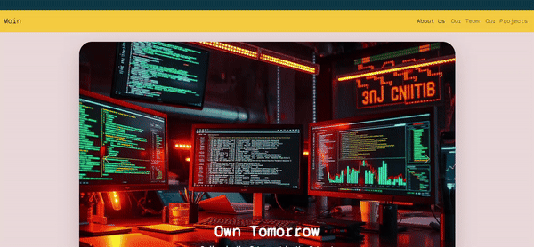

# Description

CodEdu is a community-driven organization founded to inspire and collaborate on innovative solutions in the tech world. The website showcases the team's passion for coding, creativity, and collaboration.

The CodEdu website is built using HTML and CSS, with a responsive design for various devices, showcasing team members and projects.

## Demo

## Technologies Used

- HTML5
- CSS3
- Bootstrap

## Features

- Fully responsive layout
- Team member and project sections
- GitHub project links

## License

This project is licensed under the [MIT](https://choosealicense.com/licenses/mit/) License
